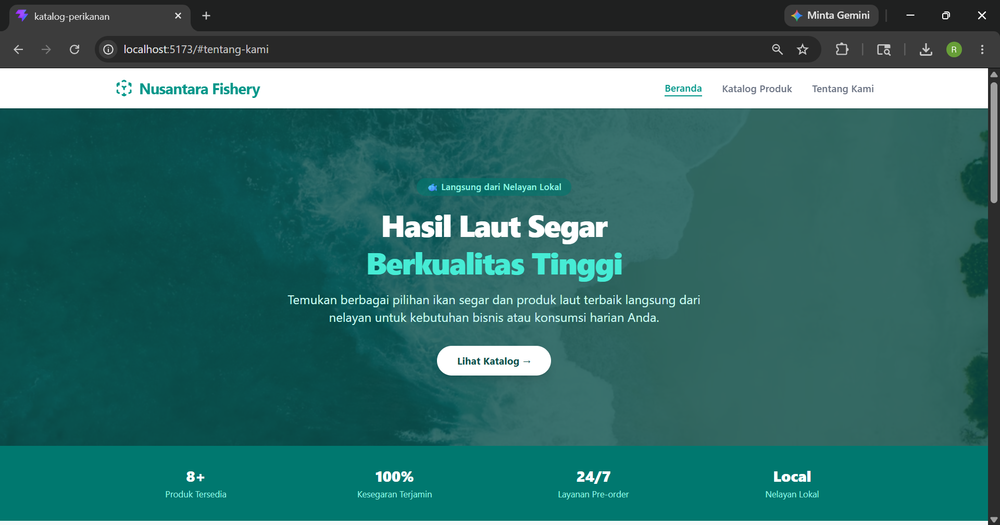
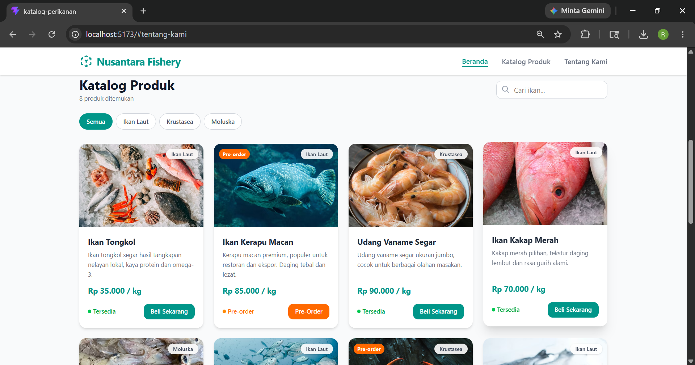

# 🐟 Nusantara Fishery — Katalog Produk Perikanan

> Website katalog produk perikanan hasil tangkap laut, dibangun menggunakan React + Vite + Tailwind CSS.



---

## 📌 Deskripsi Proyek

**Nusantara Fishery** adalah website katalog produk perikanan berbasis frontend yang menampilkan berbagai hasil laut segar dari nelayan lokal. Website ini dibuat sebagai tugas mata kuliah Pemrograman Desain Web dengan fokus pada tampilan UI/UX yang responsif dan modern.

Fitur utama yang tersedia:
- Menampilkan katalog produk ikan laut dalam bentuk grid kartu
- Filter produk berdasarkan kategori (Ikan Laut, Krustasea, Moluska)
- Pencarian produk secara real-time menggunakan state React
- Tampilan responsif untuk desktop dan mobile
- Status produk: **Tersedia** dan **Pre-order**
- Halaman Tentang Kami dengan informasi singkat perusahaan

---

## 🛠️ Teknologi yang Digunakan

| Teknologi | Versi | Keterangan |
|-----------|-------|------------|
| [React](https://react.dev/) | 18.x | Library UI berbasis komponen |
| [Vite](https://vitejs.dev/) | 5.x | Build tool & dev server |
| [Tailwind CSS](https://tailwindcss.com/) | 3.x | Utility-first CSS framework |

---

## 🚀 Cara Menjalankan Secara Lokal

### Prasyarat
Pastikan sudah menginstall:
- [Node.js](https://nodejs.org/) versi 18 ke atas
- npm atau yarn

### Langkah-langkah

```bash
# 1. Clone repositori ini
git clone https://github.com/USERNAME/NAMA-REPO.git

# 2. Masuk ke direktori proyek
cd NAMA-REPO

# 3. Install dependensi
npm install

# 4. Jalankan development server
npm run dev
'''

Buka browser dan akses: `http://localhost:5173`
'''
---

## 📁 Struktur Proyek

```
📦 nusantara-fishery
├── 📂 public/
│   └── favicon.ico
├── 📂 src/
│   ├── App.jsx          # Komponen utama & data produk
│   ├── main.jsx         # Entry point React
│   └── index.css        # Global styles (Tailwind directives)
├── index.html
├── package.json
├── vite.config.js
├── tailwind.config.js
└── README.md
```

---

## 📸 Screenshot


### Halaman Beranda


### Halaman Katalog Produk


### Halaman Tentang Kami


## 📝 Catatan 

- Data produk disimpan sementara menggunakan **Array JavaScript** di dalam komponen React (tanpa backend/database)
- Gambar produk menggunakan foto gratis dari [Unsplash](https://unsplash.com)
- Routing menggunakan anchor scroll tanpa React Router

---

## 👤 Identitas

| | |
|---|---|
| **Nama** | Restu Chandra Fitrianto |
| **NIM** | 20240140176 |
| **Mata Kuliah** | Pemrograman Desain Web |
| **Kelas** | D |

---

## 📄 Lisensi

Proyek ini dibuat untuk keperluan tugas akademik.  
© 2026 Restu Chandra — Nusantara Fishery. All rights reserved.